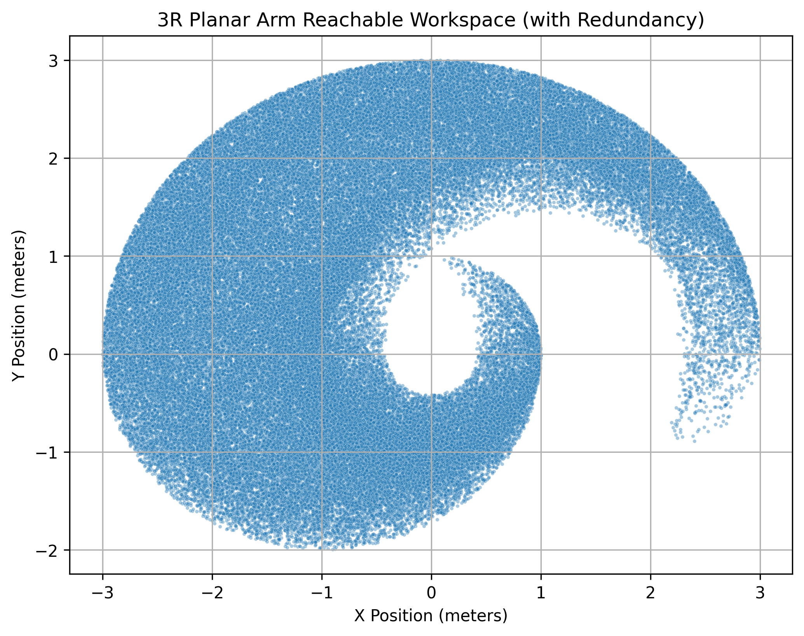

# 3R Robotic Arm Inverse Kinematics using Deep Learning

This project uses a Neural Network to predict the joint angles of a 3-DOF (3R) planar robotic arm. The goal was to solve Inverse Kinematics (IK) using machine learning instead of computationally heavy math like Jacobian matrices.

## The Problem: Kinematic Redundancy
Normally, a 3-link robotic arm has infinite ways to reach a single (x, y) coordinate. If you just feed (x, y) into a neural network, the model gets confused because there are too many correct answers. It tries to average them out, which resulted in a massive error of around 30 degrees during my initial testing.

## How I Fixed It
To stop the network from getting confused, I added two geometric rules to the dataset so there is only **one** possible pose for every target:
1. **Adding Orientation ($\phi$):** I gave the network the final end-effector angle ($\phi$) as a 3rd input. 
2. **Elbow-Up Rule:** I restricted Joint 2 ($\theta_2$) to only bend in positive angles (0 to 180 degrees). This stops the arm from flipping upside down.

## Model Details
* **Algorithm:** Multi-Layer Perceptron (`MLPRegressor` from Scikit-Learn).
* **Data Scaling:** I used a double-scaler approach. Both the inputs (X) and the target angles (Y) were scaled between -1 and 1 using `MinMaxScaler`. This helped the network learn the trigonometric patterns without the gradients vanishing.
* **Dataset:** 100,000 synthetic geometric points generated in Python.

## Results
By fixing the redundancy and scaling the data properly, the model learned the inverse kinematics successfully.
* **Final Accuracy:** 1.84 degrees Mean Absolute Error (MAE).
* **Speed:** Because it uses a simple forward pass instead of iterative loops, it predicts the angles almost instantly.

## Built With
* Python
* Scikit-Learn
* Pandas & NumPy
* Seaborn & Matplotlib

